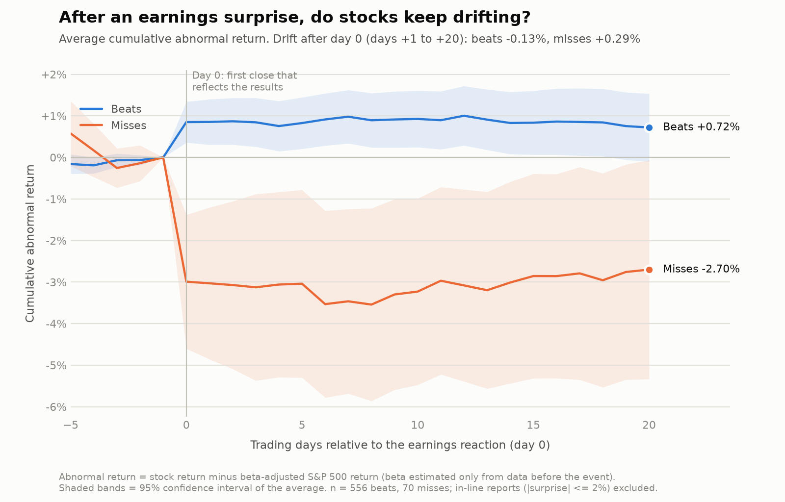

# Post-Earnings Announcement Drift (PEAD) Event Study

When a company beats analyst earnings expectations, does its stock keep rising in the weeks afterwards? And does it keep falling after a miss? If so, the market isn't fully pricing in the news on day one. This project tests that on 40 large US stocks over the last five years of earnings reports, using Python, yfinance and a set of t-tests.

The effect is well known in the academic literature (Ball and Brown, 1968; Bernard and Thomas, 1989), but more recent work suggests it has mostly faded in big, heavily-covered stocks like the ones I'm using (see Martineau, "Rest in Peace Post-Earnings Announcement Drift", 2022). So I went in treating "no significant drift" as a perfectly reasonable answer. The aim was to run the test properly, not to force a result.

## What I did

1. **Universe.** A fixed list of 40 large-cap US stocks across eight sectors, chosen before looking at any results. The market benchmark is SPY.
2. **Earnings data.** For each stock I pulled report dates, announcement times, consensus EPS and reported EPS from yfinance. The script prints how much coverage it actually gets. If yfinance falls short, it can use Alpha Vantage or a CSV instead.
3. **Beat or miss.** Surprise is (actual - consensus) / |consensus|. Above +2% is a beat, below -2% is a miss, and anything in between is in-line and dropped. Reports with a consensus under $0.10 are also dropped, because percentages on tiny numbers are meaningless.
4. **Find day 0.** This is the first trading day whose closing price already reflects the news: the same day for a before-open report, the next day for an after-close one.
5. **Abnormal returns.** For every day from 5 days before to 20 days after day 0, I take the stock's return minus the return you'd expect given what the market did.
6. **Add them up** into cumulative abnormal returns (CARs) over 1, 5, 10 and 20 days after day 0.
7. **Test.** Average the CARs for beats and for misses, then t-test whether each group differs from zero and whether the two differ from each other.

## Criteria for a Abnormal Return for this project

**Abnormal return.** The stock's actual return minus its expected return. If the market rose 1% and the stock normally moves 1.2x the market, the expected return is about 1.2%. A 3% actual move then leaves an abnormal return of about +1.8%. This strips out market-wide moves so what's left is specific to the stock.

My main method is the market model: expected return = alpha + beta x market return, with alpha and beta estimated from the stock's own history before the event. As checks I also use "stock minus S&P 500" and "stock minus its sector ETF". The sector version is a weaker check for mega-caps because the stock is a big part of its own sector ETF.

**CAR[1,20].** The abnormal returns from day +1 to day +20 added together. Starting at day +1 matters: day 0 holds the big announcement jump, which happens in any market and isn't the anomaly. Only what happens after the news is public counts as drift. I also report CAR[0,k], which includes the jump, for context only.

**t-test and p-value.** Even with no real effect, an average of a few hundred noisy stock moves won't land on exactly zero. The t-statistic asks how many "standard errors" the average sits from zero, where the standard error is the noise in individual events divided by the square root of the number of events. The p-value is the chance of seeing something at least that extreme if there were truly no effect. Below 0.05 I call it statistically significant. That says nothing about whether the effect is big, or whether you could trade it after costs.

I run a one-sample t-test for each group (is it different from zero?) and a Welch two-sample t-test for beats against misses (do they differ?). The gap between the two groups is the number I trust most, because anything that hits both groups equally cancels out.

**Clustering by quarter.** Reports bunch up in earnings seasons and share market shocks, so events aren't fully independent. As a stricter check I average within each calendar quarter first, then t-test across quarters.

## Avoiding lookahead bias

- Beta and alpha use only data from 250 to 31 trading days before day 0. The code asserts that this window ends before the event window starts.
- Drift is measured from the close of day 0, after the surprise is public.
- If an announcement time is missing, I assume after-close. That can only cost one day of drift and can never leak the jump into it.
- Beat/miss uses only the reported EPS and the consensus for that report.
- The 2% threshold was fixed in advance. I also show 5% and 10%, but I don't pick whichever looks best.

## Results

<!-- RESULTS:START -->
Results are generated by `python pead_event_study.py` and appear here.
<!-- RESULTS:END -->

To read the tables: each window shows beats, then misses, then the gap between them. "avg" is the mean cumulative abnormal return, and the t-stat and p-value test it against zero (or, for the gap, test beats against misses). If PEAD is present I'd expect beats clearly positive, misses clearly negative, a positive gap, and p below 0.05 mainly at the longer windows.

## Checking the code on synthetic data

A test can find things that aren't there, so before using real data I checked the pipeline on a fake market where I know the answer.

- With a drift planted (+1% over 20 days after beats, -1% after misses), it recovered a beat-minus-miss gap of +1.93% against the true 2.0% (p < 0.001).
- With no drift planted, I ran 30 different random seeds. Two came out significant at the 5% level, against about 1.5 expected by chance alone.
- I recomputed betas, CARs and t-statistics for random events with separate code, and they matched. The day-0 timing rule has its own test.

One side effect: in the no-drift runs both groups sat slightly below zero (about -0.3%), because the stock's normal return is estimated over a window that includes earlier earnings jumps. It hits beats and misses equally, so it cancels in the gap.

These checks are about the code, not the market, and live in `results_selftest/`.

## Limitations

- **Survivorship bias.** The universe is today's large caps, which are past winners. Delisted or shrunken companies aren't in it. Point-in-time index membership would fix this.
- **Mega-caps are the hardest place to find PEAD.** They're covered by dozens of analysts, so any drift should be competed away fastest. The literature finds it stronger in small, illiquid stocks.
- **Low power.** Once in-line reports are dropped there may only be 100-200 misses, and 20-day abnormal returns are noisy. An effect of half a percent would be hard to detect. Not rejecting "no drift" isn't proof that there is none.
- **Data quality.** yfinance is free and unaudited. I can't confirm the stored consensus is the pre-announcement figure, or that reported EPS hasn't been adjusted since. A point-in-time source such as I/B/E/S would be better.
- **Announcement timing.** Missing times are treated as after-close. That's safe but adds noise, and the robustness table also reports results using only events with a known time.
- **Overlapping events.** Quarter clustering helps, but with about 20 quarters it has little power.
- **Confounding news.** Earnings days often bring guidance, buyback announcements and macro news. I measure the total abnormal move, not the pure effect of the EPS surprise.
- **Multiple tests.** Four windows, two groups and several robustness checks means one significant result could easily be chance. That's why the 20-day gap was fixed as the main test in advance.
- **Simple model.** A one-factor market model ignores size, value and momentum.
- **Not a strategy.** No transaction costs, spreads, borrow costs or shorting constraints, and returns assume closing prices.
- **Sample period.** 2021-2026 includes the 2022 bear market and an AI-driven rally. The first-half vs second-half check shows how stable the result is.
